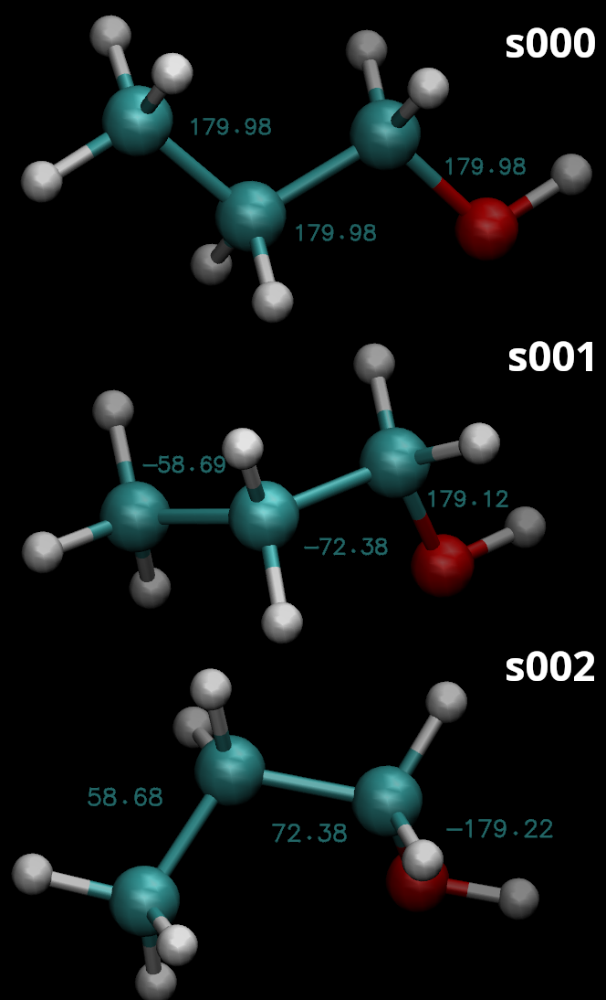

.. _confsearch-tutorial:

3D Conformer Search
=================================

This tutorial will show how to get plausible 3D conformers for a molecule.  The molecule can be an input structure, a SMILES string, or an InChi string.

Learning Objectives
-------------------

Tutorial
--------

1. User Options
~~~~~~~~~~~~~~~

 .. code-block::

    usage: ffpopt-ConfSearch.py [-h] [--nconf NCONF] [--nkeep NKEEP] [--searchmaxit SEARCHMAXIT] [-t SEARCHRMSTOL] [--uff] [--quiet] [-o OUT] name_or_string

    Read or create a structure and search for conformations

    positional arguments:
      name_or_string        Either a filename, Inchi string, or smiles string

    options:
      -h, --help            show this help message and exit
      --nconf NCONF         Initial number of conformations to geometry optimize. (default: 100)
      --nkeep NKEEP         The number of low-energy clustered conformations to save. (default: 5)
      --searchmaxit SEARCHMAXIT
                            The number of UFF/MMFF94 geometry optimization steps. (default: 250)
      -t SEARCHRMSTOL, --searchrmstol SEARCHRMSTOL
                            The RMS tolerance used to cluster the structures in Angstrom (default: 0.5)
      --uff                 If present, optimize with UFF (recommended if metals are present). The default is MMFF94 (recommended for small molecule organic drug-like molecules)
      --quiet               If present, do not print informative messages to stdout
      -o OUT, --out OUT     Output json file (default: confs.json)

2. Running ffpopt-ConfSearch.py
~~~~~~~~~~~~~~~~~~~~~~~~~~~~~~~
The conformer search is performed with ffpopt-ConfSearch.py.
Here is an example that generates structures for 1-propanol given its InChi string.

.. code-block::

   ffpopt-ConfSearch.py -o confs.json 'InChI=1S/C3H8O/c1-2-3-4/h4H,2-3H2,1H3'

The output is the confs.json file.  You do not have to specify an InChi string; you could supply it with a json structure file (mol.json) or a mol2 file (mol.mol2).  This script is often convienent, however, for transforming SMILES/InChi strings to 3D structures.

The output json file often contains more than 1 structure. The lowest energy conformer is the structure named "s000". The second lowest energy conformer is "s001", etc.  The maximum number of allowable output conformations is an input option that defaults to 5.

3. Getting the structures from the output
~~~~~~~~~~~~~~~~~~~~~~~~~~~~~~~~~~~~~~~~~
You can use ffpopt-Json2Crds.py to extract the structures from confs.json.
The name of the output file will determine the output file format.

   a. ".xyz" -> XYZ format
   b. ".mol2" -> MOL2 format
   c. ".rst7" -> Amber formatted restart format
   d. ".pdb" -> PDB format

.. code-block::

   ffpopt-Json2Crds.py -i confs.json -o confs.pdb

The example will create 3 files: confs_s000.pdb, confs_s001.pdb, and confs_s002.pdb because the search algorithm wrote 3 conformers within confs.json.  The sXXX labels are default names assigned to each conformer (sXXX -> "structure XXX").  Some of the scripts allow you to extract specific structures from a file via the structure name.

   The propanol conformers generated by ffpopt-ConfSearch.py

4. How did it find the structures? How did it work?
~~~~~~~~~~~~~~~~~~~~~~~~~~~~~~~~~~~~~~~~~~~~~~~~~~~

   a. RDKit is used to transform the input SMILES/InChi to an internal-representation of a 3d molecule. If the input is a file, it is read with parmed or an ffpopt internal parser.
   b. The ETKDGv3 algorithm within RDKit is used to create a large number of conformations (the exact number is an input option that defaults to 100).
   c. Each of the conformations produced by the ETKDGv3 algorithm are geometry optimized with RDKit using the MMFF94 force field. There is an option to instead use the UFF force field, which could be better if there are metal ions.
   d. The Butina clustering algorithm in RDKit is used to group the optimized structures into clusters based on their relative coordinate root mean square deviation.  The cluster sizes are determined by a CRMS tolerance that defaults to 0.5 Ang.
   e. Each cluster is pruned to contain only 1 structure: the lowest energy conformation within the cluster.
   f. The clusters are sorted by increasing potential energy.
   g. The lowest energy clusters are written to the output file.
